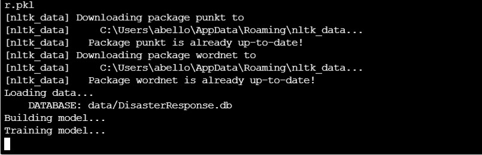

<br />
<p align="center">
  <a href="https://github.com/raymonbell01/Text_classification_Project">
    
  </a>

  <h3 align="center">Disaster Response Pipeline Project - (Text Classifier - Udacity Nano Degree Program)</h3>

  <p align="center">
    The goal of this project is to classify text messages to assist with disaster response 
    <br />
    <a href="https://github.com/raymonbell01/Text_classification_Project"><strong>Explore the docs »</strong></a>
    <br />
    <br />
    <a href="https://github.com/raymonbell01/Text_classification_Project">View Demo</a>
    ·
    <a href="https://github.com/raymonbell01/Text_classification_Project/issues">Report Bug</a>
    ·
    <a href="https://github.com/raymonbell01/Text_classification_Project/issues">Request Feature</a>
  </p>
</p>


# Disaster Response Pipeline Project
This project is for Udacity Nano Degree Program. It classifies text messages into 36 different variable.


### Quick Instructions:
1. Run the following commands in the project's root directory to set up your database and model.

    - To run ETL pipeline that cleans data and stores in database
        `python data/process_data.py data/disaster_messages.csv data/disaster_categories.csv data/DisasterResponse.db`
    - To run ML pipeline that trains classifier and saves
        `python models/train_classifier.py data/DisasterResponse.db models/classifier.pkl`

2. Run the following command in the app's directory to run your web app.
    `python run.py`

3. Go to http://0.0.0.0:3001/


<details open="open">
  <summary><h2 style="display: inline-block">Table of Contents</h2></summary>
  <ol>
    <li>
      <a href="#about-the-project">About The Project</a>
    </li>
    <li>
        <a href="#installation">installation</a>
    </li>
    <li>
      <a href="#file_descriptions">File Descriptions</a>
    </li>
    <li><a href="#roadmap">How To Interact With Your Project</a></li>
    <li><a href="#contributing">Licensing, Authors, Acknowledgements</a></li>
    <li><a href="#contact">Contact</a></li>

  </ol>
</details>


<!-- ABOUT THE PROJECT -->
## About The Project 
This project was developed to help disaster response organisation to easily filter through text messages received during disasters. It help categorise the text messages received into proper category and respective organisation can pick relevant information.
This repo was developed to give guide users on how to leverage the analysis for future project or replicate the same.
`raymonbell`, 
`StackOverflow-Survey-2020`, 
`@raymonbell`, 
`belloramon2014@gmail.com`, 
`women participation in software development in Africa`, 
`Data Science`

## Installation

* To reporduce this ML Project pip install and import the following python library in your machine

```sh
import sys
import pandas as pd
import numpy as np
import re
import pickle

from sqlalchemy import create_engine
from nltk.tokenize import word_tokenize
from nltk.corpus import stopwords
from nltk.stem.wordnet import WordNetLemmatizer

import nltk
nltk.download(['punkt','wordnet'])

from sklearn.pipeline import Pipeline
#from sklearn.metrics import confusion_matrix
from sklearn.model_selection import train_test_split
from sklearn.feature_extraction.text import CountVectorizer, TfidfTransformer
from sklearn.metrics import classification_report

from sklearn.multioutput import MultiOutputClassifier
from sklearn.ensemble import RandomForestClassifier
from sklearn.model_selection import GridSearchCV
```

## File Descriptions

The jupyter notebook file import the libraries required for the analysis, clean
The two major file in this project can be found in "data/process_data.py" and "train_classifier.py"

### data/process_data.py 
clean the text data and merged with respective categories. The file create .db file that ws later used in the train_classifier.py

### models/train_classifer.py
In this file we seperate on dataframe into X and Y and pass the text data into our pipeline and GridSearchCV for cross validation
The output pickle file was saved in the model folder to be used in our web app

## How To Interact With Your Project

To replicate this work kindly follow the inttruction detailed in installation and run file via Jupyter notebook.


## Licensing, Authors, Acknowledgements

Contributions are what make the open source community such an amazing place to be learn, inspire, and create. Any contributions you make are greatly appreciated.
Distributed under the MIT License. See `LICENSE` for more information.

<!-- CONTACT -->
## Contact

Your Name - [@raymonbell](https://twitter.com/raymonbell) - email - belloramon2014@gmail.com

Project Link: [https://github.com/StackOverflow-Survey-2020/repo_name](https://github.com/StackOverflow-Survey-2020/repo_name)

